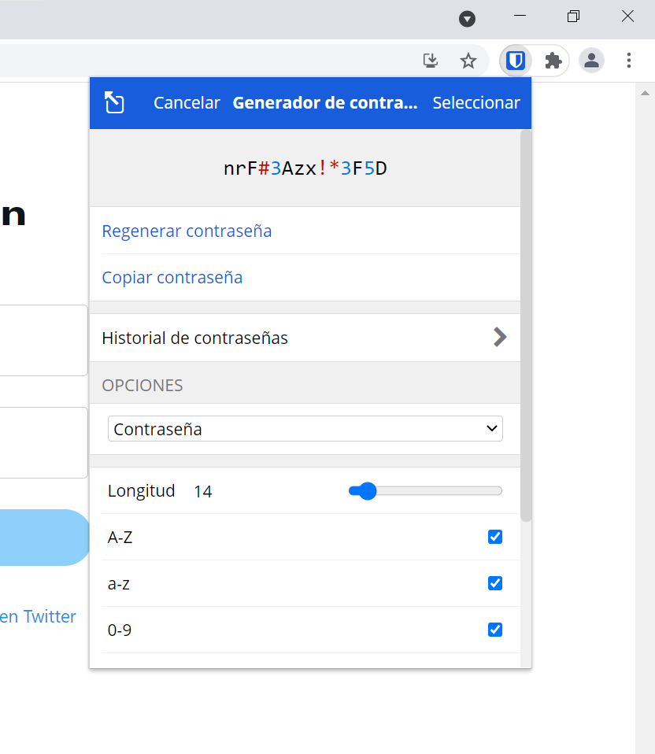
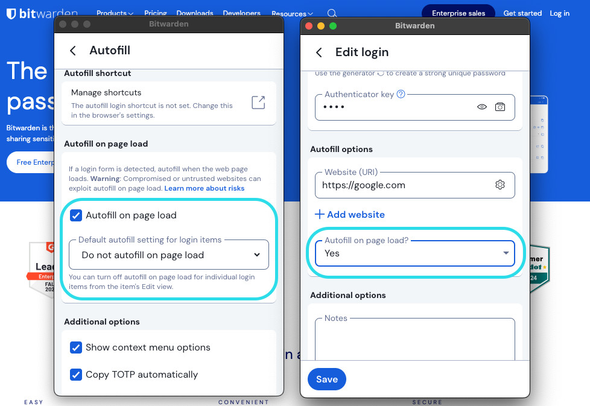

# 🧭 Guia d’Ús Tècnica – Bitwarden

## 1️⃣ Instal·lació i Configuració Inicial

### 🖥️ Pas 1: Descàrrega
Aneu a 👉 [https://bitwarden.com/download](https://bitwarden.com/download)  
i descarregueu:
- 💻 Aplicació d’escriptori  
- 🌐 Extensió del navegador  
- 📱 Aplicació mòbil (Android / iOS)

)

### 🔑 Pas 2: Creació del Compte
1. Feu clic a **Create Account**.  
2. Introduïu el vostre correu corporatiu. 📧  
3. Trieu una **Contrasenya Mestra forta** (mínim 14 caràcters).  
4. Activeu **Two-Factor Authentication (2FA)** per més seguretat. 🔐

---

## 2️⃣ Generació de Contrasenyes Segures

1. Aneu a **Tools → Password Generator**. 🛠️  
2. Configureu:
   - 🔢 Longitud: 16–24 caràcters  
   - ✅ Incloure símbols, números i majúscules  
3. Copieu i deseu la contrasenya generada.

💡 *Consell:* utilitzeu paraules aleatòries o frases si voleu una contrasenya recordable (passphrase).

---

## 3️⃣ Emmagatzematge i Emplenament Automàtic

### 🗂️ Desar una credencial
1. Aneu a **Vault → Add Item**.  
2. Ompliu els camps:
   - Nom: `Correu corporatiu`
   - Usuari: `usuari@everpia.com`
   - Contrasenya: *(Generada)*
   - URL: `https://mail.everpia.com`
3. Feu clic a **Save** 💾

### ⚡ Emplenament automàtic
1. Aneu al lloc web.  
2. L’extensió del navegador mostrarà el logotip de Bitwarden.  
3. Feu clic i seleccioneu **Autofill**. 🚀  

---

## 4️⃣ Còpies de Seguretat 🔄

### 💾 Exportació del Vault
1. A l’app: **File → Export Vault**  
2. Format recomanat: `.json` o `.csv` **xifrat**.  
3. Deseu-lo en un dispositiu segur:
   - 🔐 USB xifrada
   - ☁️ Núvol amb xifratge addicional (com Nextcloud o Tresorit)

**Bones pràctiques:**
- Mantenir **dues còpies** actualitzades. 🧱  
- No guardar mai l’arxiu sense xifrar. 🚫  
- Verificar les còpies de seguretat regularment. ⏱️  

---

## 5️⃣ Conclusions 🎯

Bitwarden ofereix una gestió **segura, eficient i multiplataforma** de les contrasenyes.  
Gràcies al seu model *end-to-end encryption* i a la seva simplicitat d’ús, garanteix la **confidencialitat, integritat i disponibilitat** de les credencials d’EverPia. 🔐💪
