# GUIA LDAP

**Per Començar instal·lem LDAP**

**Seguidament haurem de posar una contrasenya per l'usuari ADMIN**

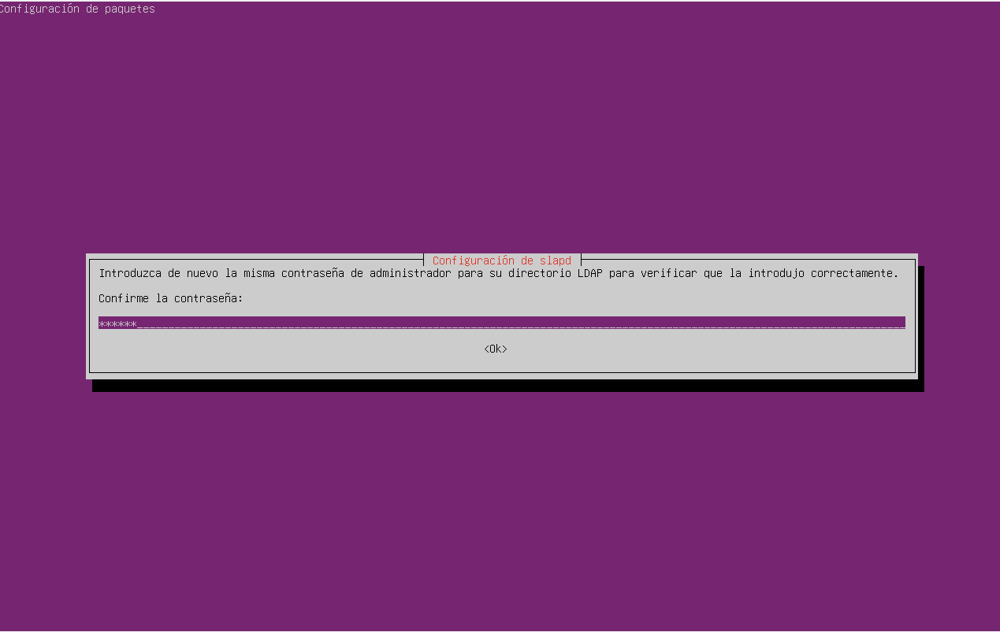

**Ara mirem el status**

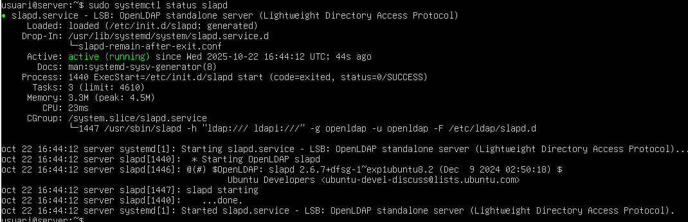

**Amb sudo slapcat comprovem que els directoris s'hagin creat amb el nom que volem**

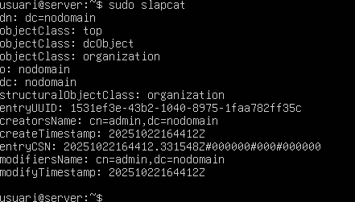

**Configurem LDAP**

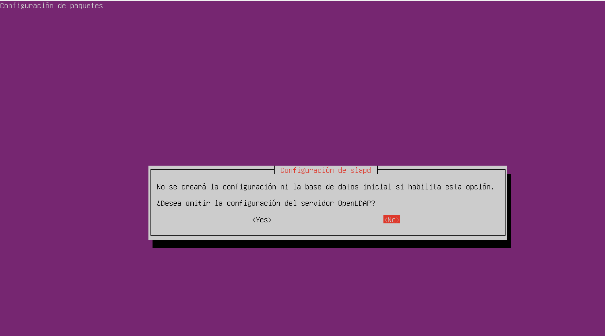

**Introduim el nom del domini DNS**

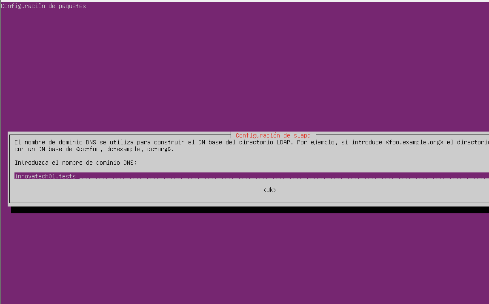

**Posem el nom de la organtizació**

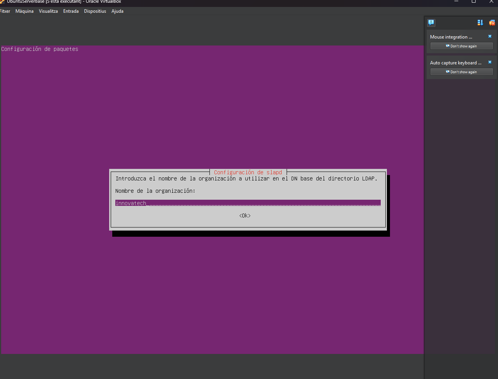

**Posem la contrasenya de l'administrador**

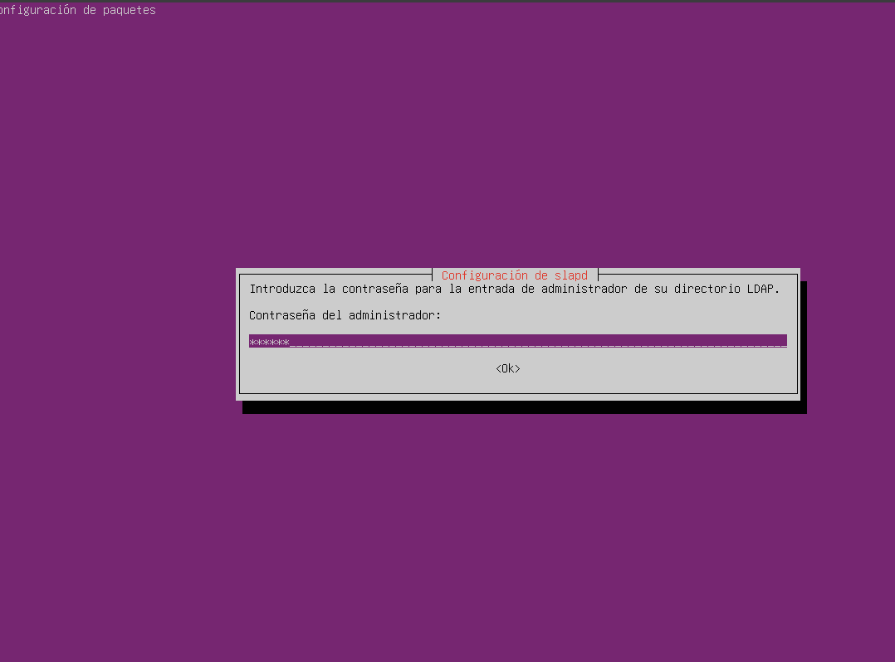

**Un cop acabem diem que si la següent pestanya**

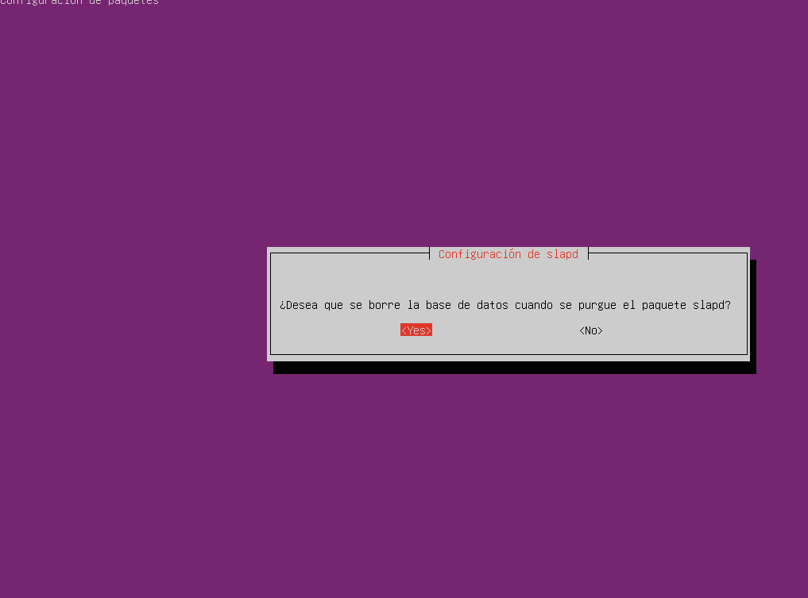

**També configurarem de forma correcte el hostname**

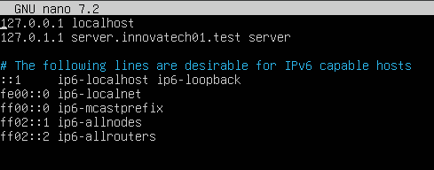

**A continuació instalarem el manager de comptes de LDAP**

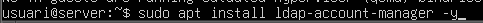

**Afegim usuaris i grups**

**Ara canviem la configuració**

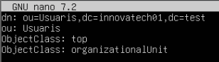

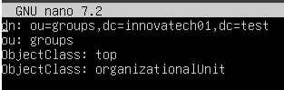

**Utilitzarem "ldapsearch"**

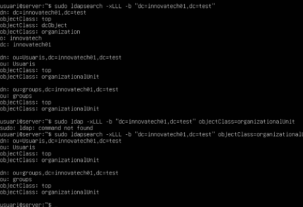

**Afegim admin a la llista**

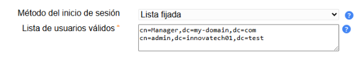

**Ara ja podem entrar a la compte**

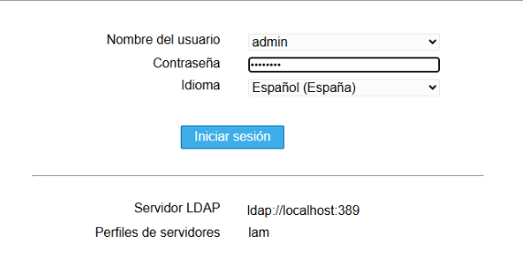

**Crearem dos Grups i dos Usaris**

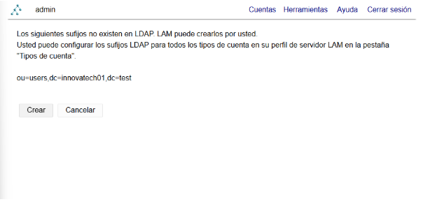

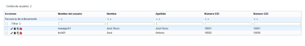

**Ara configurem el nom del client**

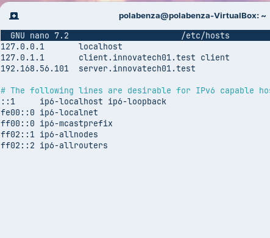

**Comprovem que els noms funcionen correctament**

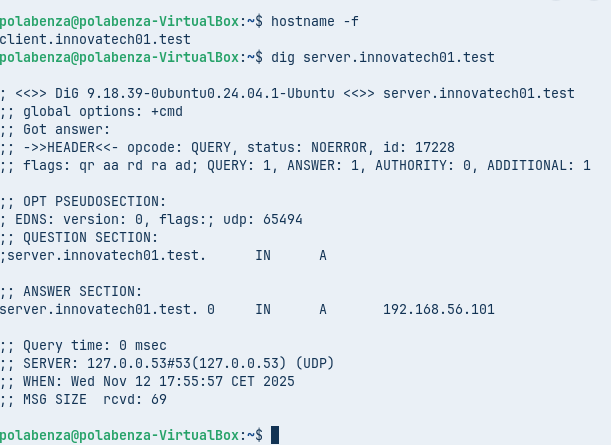^

**Ara instal·lem els moduls necessaris**

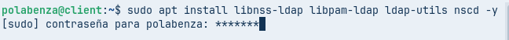

**Ara els configurem**

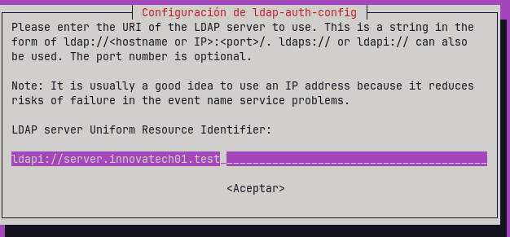

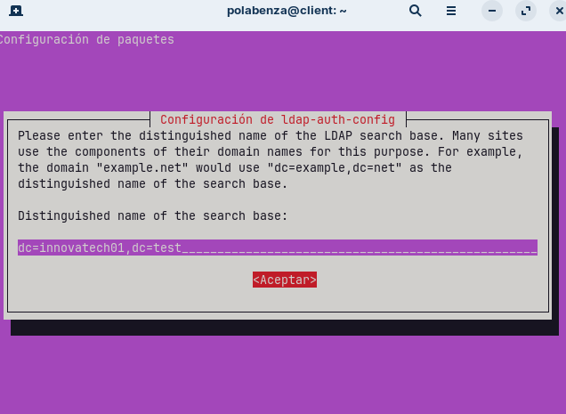

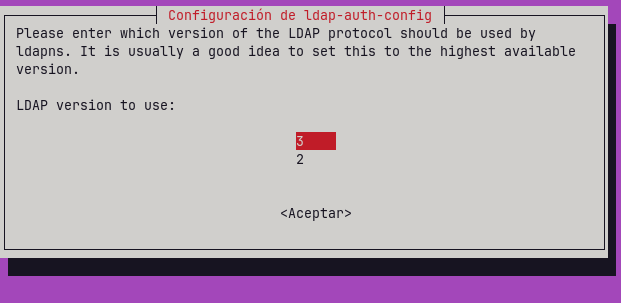

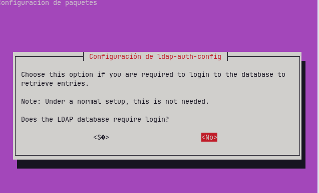

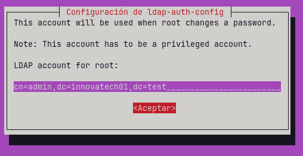

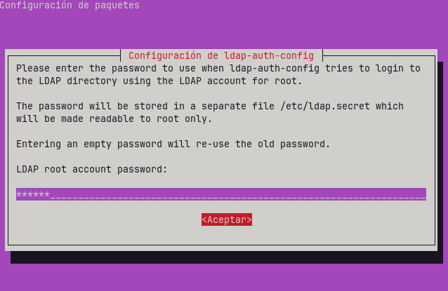

**Cambiem la configuració de l'arxiu /etc/nsswitch.conf**

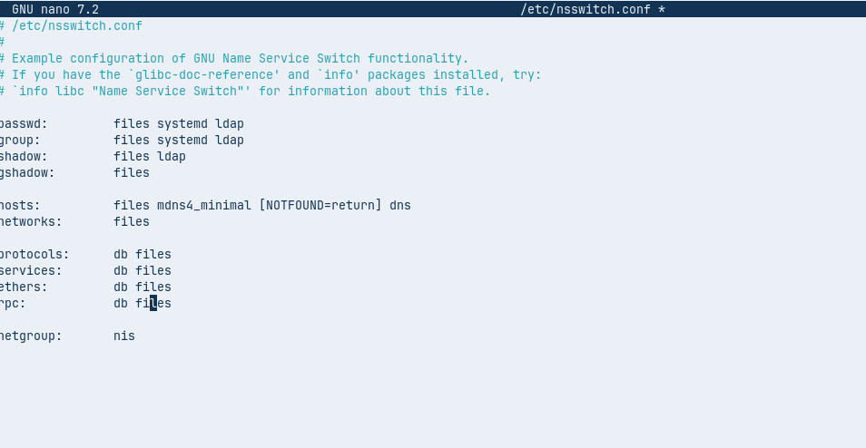

**També modifiquem l'arxiu /etc/pam.d/common-password**

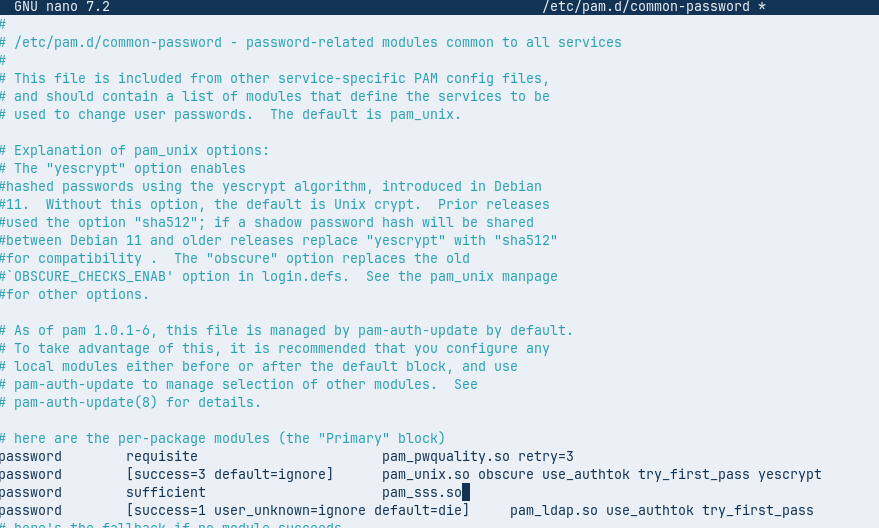

**I també modifiquem l'arxiu /etc/pam.d/common-session**

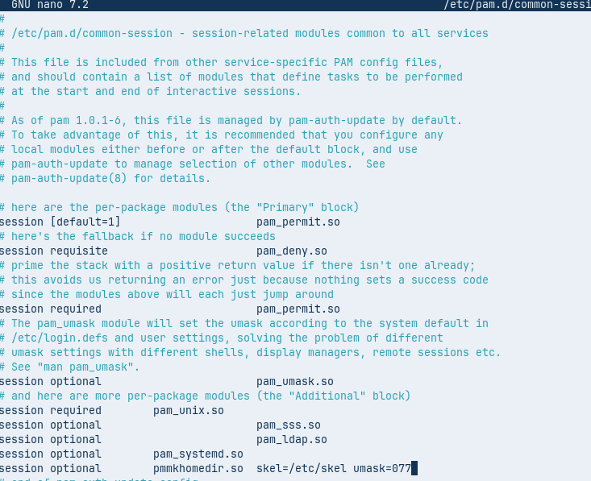