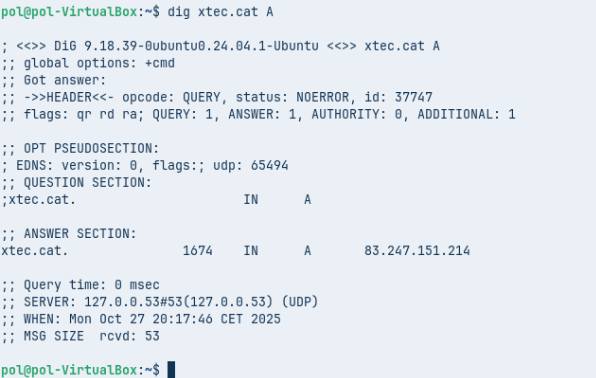
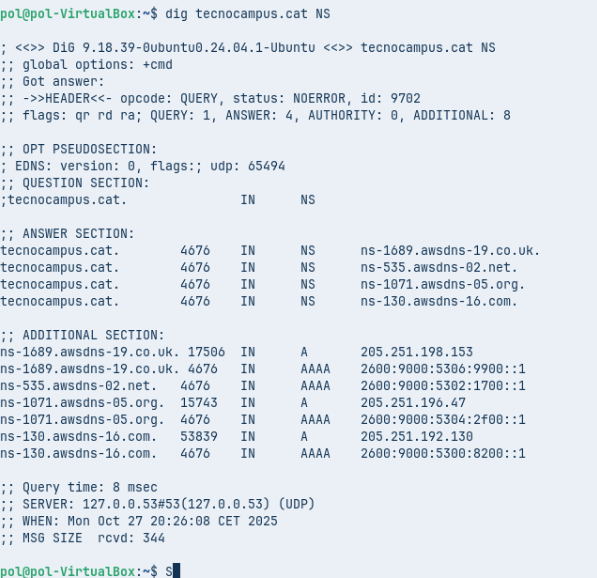
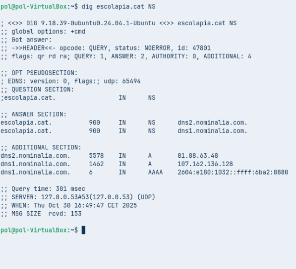
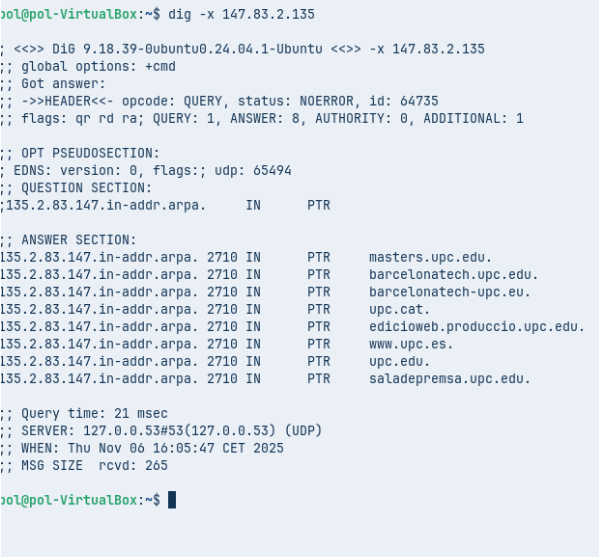
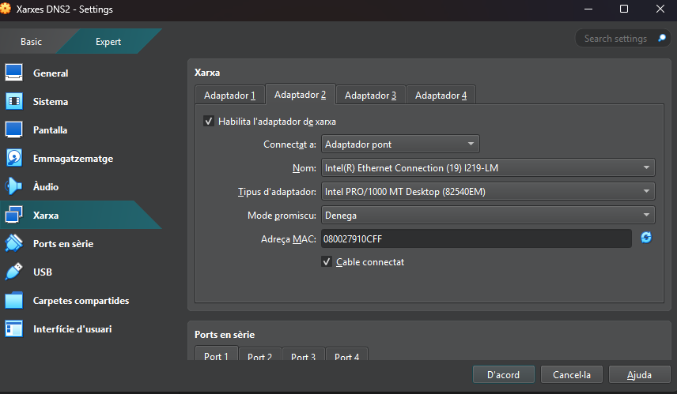

## A. Diagnosi amb dig (Linux / macOS)

- **Executa dig xtec.cat A**

- **Anàlisi:** IP resposta: **83.247.151.214**, TTL: **3558**, servidor: **127.0.0.53#53 UPD**.

### Comanda 2: Consulta NS

- **Executa dig tecnocampus.cat NS**

- **Anàlisi:** Servidors autoritatius:
  
  **ns-1689.awsdns-19.co.uk.**
  **ns-1071.awsdns-05.org.**
  **ns-535.awsdns-02.net.**
  **ns-130.awsdns-16.com.**

### Comanda 3: Consulta SOA

- **Executa dig escolapia.cat SOA**

- **Anàlisi:** El correu de l'administrador: **root.dns1.nominalia.com** i la sèrie és: **1761028965**.

### Comanda 4: Consulta inversa

- **Executa dig -x 147.83.2.135**

- **Anàlisi:** Ensenya dominis a la IP: **upc.edu, barcelonatech-upc.eu, upc.cat, masters.upc.edu**.

## B. Resolució amb nslookup

### Comanda 1: Consulta no autoritativa

- **Type=A, domini tecnocampus.cat**

- **Anàlisi:** Resposta no autoritativa perquè el DNS  agafa la info d'un altre servidor.

### Comanda 2: Consulta autoritativa

- **Server IP:** primer servidor de noms de tecnocampus.cat. Consulta type=A del domini.

- **Anàlisi:** La resposta és autoritativa, no surt el missatge de no autoritatiu.

## C. Resolució local

Comprova la resolució local, útil en xarxa sense servidor de noms.

Configura adaptador pont.

Assigna IP **192.168.4.26/24**.

Fes **ping** a una altra màquina per verificar la resolució local.